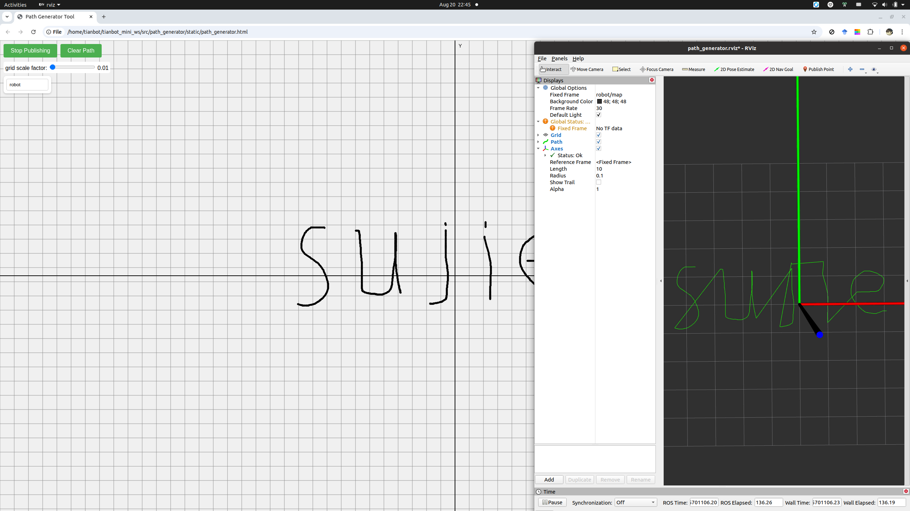

# Path Generator

A ROS tool for path generator by drawing line in browser or rviz.

## Installation

```bash
mkdir -p ~/catkin_ws/src
cd ~/catkin_ws/src
git clone https://github.com/sujit-168/ros_path_generator.git
cd .. && catkin_make
```

## Usage

### path generator with draw in browser

```bash
source ~/catkin_ws/devel/setup.bash
export ROBOT_NAME=robot
roslaunch path_generator path_generator_with_draw.launch 
```

